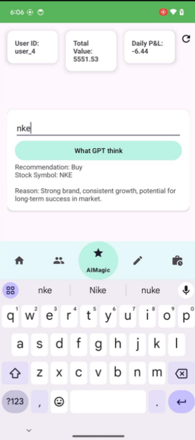

# SmartInvest 📈💼

**SmartInvest** is a mobile application designed to streamline investment decisions and portfolio management. It integrates real-time data, AI-driven insights, and secure backend communication to provide a comprehensive tool for managing and analyzing investments.

---

## 🚀 **Features**

### 📊 **Portfolio Management**
- **Interactive Brokers Integration**: Real-time stock data, buying, and selling capabilities using the **Interactive Brokers API**.
- **Detailed Financial Summaries**: Fetches financial summaries, including available funds, net liquidation value, and invested capital.
- **Python Backend**: Built using **Quart**, hosted on **AWS**, for managing stock transactions and portfolio data.

### 🤖 **AI-Powered Recommendations**
- **OpenAI GPT Integration**: Provides AI-driven buy/sell recommendations for stocks with concise reasons.
- **Secure API Management**: API keys are securely fetched using **Firebase Remote Config**.

### 📈 **Data Visualization**
- **Dynamic Charts**: Pie and bar charts in the app visualize sector distribution and asset breakdown.
- **Retrofit Communication**: Ensures seamless and secure data exchange between the app and backend.

---

## 🛠️ **Technologies Used**

- **Frontend**: Kotlin, Android Studio
- **Backend**: Python (Quart), AWS
- **APIs**:
  - **Interactive Brokers API**: Real-time trading and financial data
  - **OpenAI GPT API**: AI-based recommendations
- **Database**: Firebase Realtime Database, Firestore
- **Configuration**: Firebase Remote Config
- **Networking**: Retrofit

---

## 📂 **Project Structure**

```
SmartInvest/
│
├── app/
│   ├── src/
│   │   └── main/
│   │       ├── java/
│   │       │   └── com.example.smartinvest/
│   │       │       ├── HomeFragment.kt
│   │       │       ├── AIFragment.kt
│   │       │       └── FirebaseConfigHelper.kt
│   │       └── res/
│   │           └── layout/
│   │               └── fragment_ai.xml
│   └── build.gradle
│
├── backend/
│   └── stock_api.py (Quart backend for managing API requests)
│
└── README.md
```

---

## 🔒 **Security Considerations**

- **Secure API Keys**: Managed through **Firebase Remote Config** to avoid exposing keys in the source code.
- **Safe Communication**: All requests use secure endpoints to prevent data breaches and ensure privacy.

---

## 🌟 **How to Use**

1. **Clone the Repository**:
   ```bash
   git clone https://github.com/arielhalevy123/SmartInvest.git
   ```

2. **Backend Setup**:
   - Install dependencies:
     ```bash
     pip install -r requirements.txt
     ```
   - Run the Quart server:
     ```bash
     python stock_api.py
     ```

3. **Firebase Setup**:
   - Add your **Firebase Remote Config** with `api_key` and `openai_api_key`.

4. **Android App**:
   - Open the project in **Android Studio**.
   - Run the app on an emulator or physical device.

---
## Screenshots

### Login Screen


### Portfolio Summary (Before Buy)


### Portfolio Summary (After Buy)


### Stock Details


### AI Recommendation


### Sector Allocation


## 🤝 **Contributions**

Feel free to fork the repository and create a pull request for any new features or improvements!
